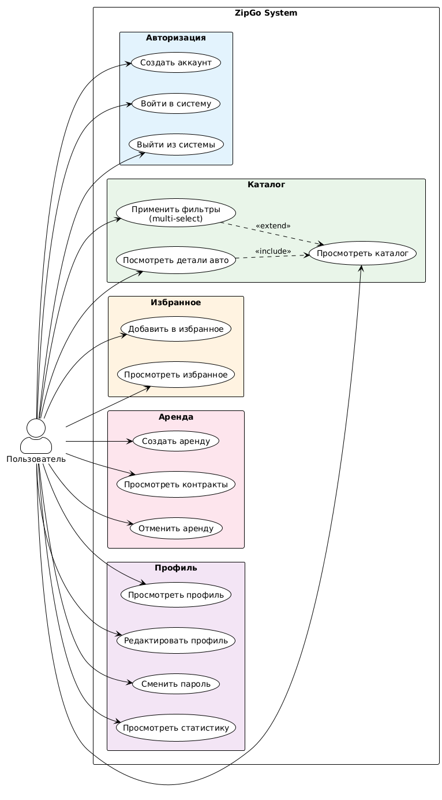
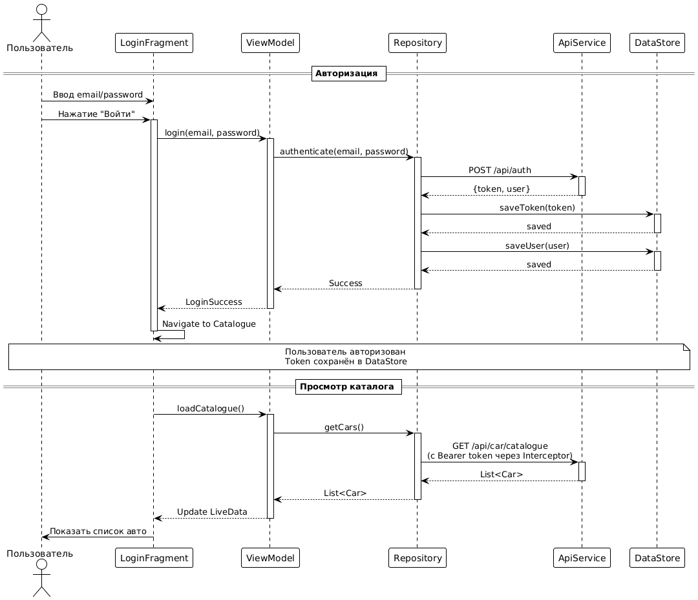
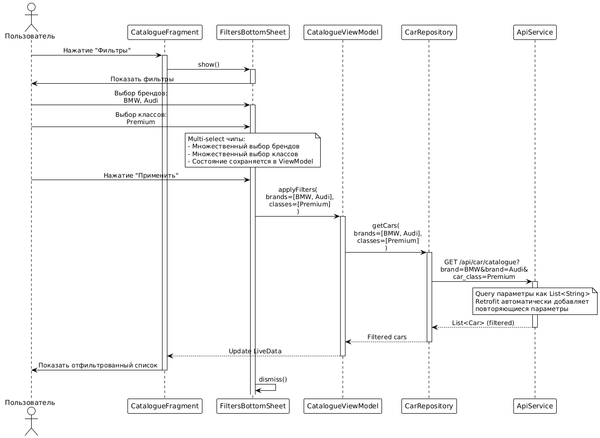
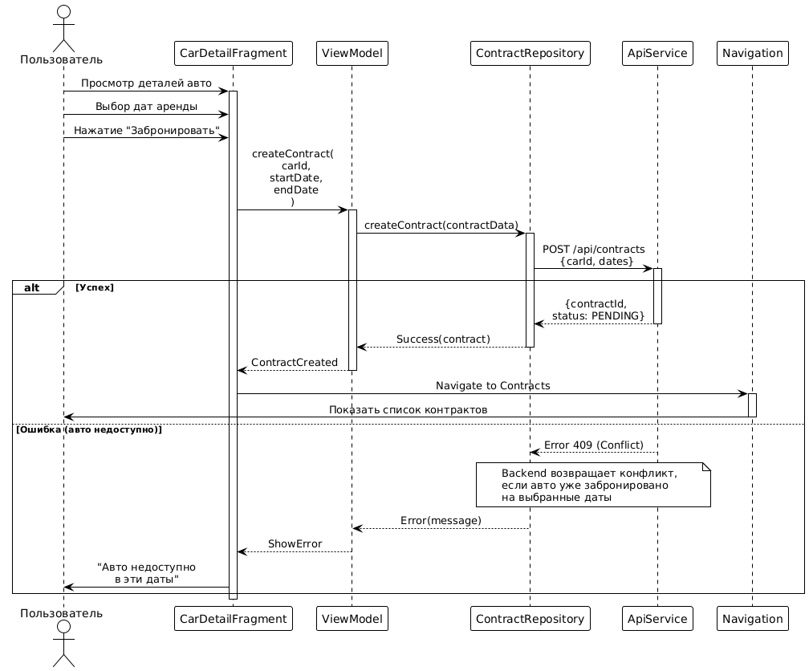
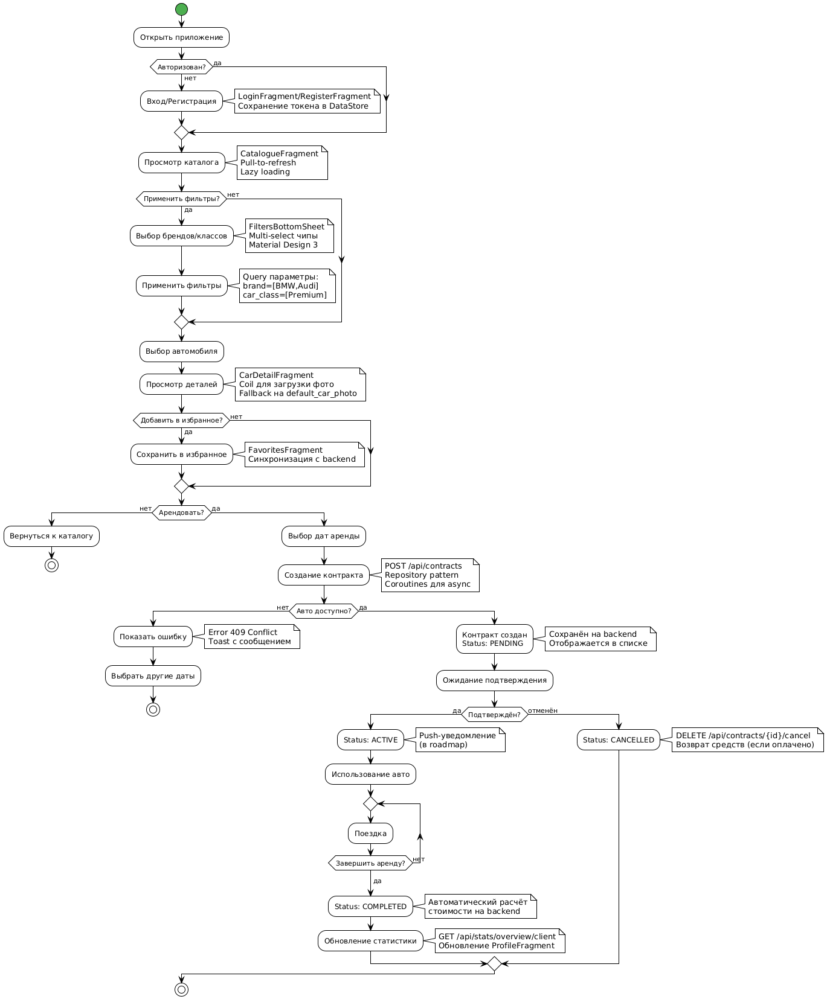

<p align="center">
  
</p>

<h1 align="center">ZipGo</h1>

<p align="center">
  <b>Каршеринг у тебя в кармане</b><br/>
  Современное Android-приложение для аренды автомобилей
</p>

<p align="center">
  
  
  
  
  
</p>

---

## О проекте

**ZipGo** — мобильный клиент каршеринг-сервиса с чистым, интуитивным UI и полным набором функций для аренды авто. Построен на современном Android-стеке с упором на UX и производительность.

---

## Возможности

| Модуль | Функционал |
|--------|------------|
| **Авторизация** | Регистрация · Вход · Безопасный logout · Хранение токена в DataStore |
| **Каталог** | Лента авто · Поиск · Multi-select фильтры (бренд, класс) · Pull-to-refresh |
| **Карточка авто** | Фото (с fallback) · Характеристики · Быстрое бронирование |
| **Избранное** | Сохранение понравившихся · Переход к деталям |
| **Аренда** | Создание брони · Список контрактов · Детали и отмена |
| **Профиль** | Статистика · Редактирование данных · Смена пароля |

---

## Технологии

```
Kotlin 1.9           —  Язык
Material 3           —  UI-дизайн
ViewBinding          —  Работа с View
Navigation Component —  Single-Activity навигация
Retrofit + OkHttp    —  Сеть
Coroutines + Flow    —  Асинхронность
Coil                 —  Загрузка изображений
DataStore            —  Локальное хранение
```

---

## Архитектура

```
┌────────────────────────────────────────────────────────┐
│                        UI Layer                        │
│   Fragments · ViewModels · Navigation · ViewBinding    │
├────────────────────────────────────────────────────────┤
│                      Domain Layer                      │
│              Repositories · Use Cases                  │
├────────────────────────────────────────────────────────┤
│                       Data Layer                       │
│    ApiService · Models · DataStore · Preferences       │
└────────────────────────────────────────────────────────┘
```

**Паттерны:** MVVM · Repository · Single-Activity

---

## Структура проекта

```
app/src/main/java/com/example/carcatalogue/
├── data/
│   ├── api/            # Retrofit ApiService, RetrofitClient
│   ├── model/          # DTO под API
│   ├── preferences/    # TokenManager, UserPreferences
│   └── repository/     # CarRepository, ContractRepository …
└── ui/
    ├── auth/           # Login, Register
    ├── catalogue/      # CatalogueFragment, FiltersBottomSheet
    ├── car_detail/     # CarDetailFragment
    ├── contracts/      # ContractsFragment, ContractDetailFragment
    ├── favorites/      # FavoritesFragment
    └── profile/        # ProfileFragment, EditProfile, ChangePassword
```

---

## Быстрый старт

```bash
# 1. Клонируй репозиторий
git clone https://github.com/user/zipgo-android.git

# 2. Открой в Android Studio (Giraffe+)

# 3. Укажи URL бэкенда в RetrofitClient.kt
BASE_URL = "https://your-api.example.com/"

# 4. Собери и запусти
./gradlew :app:assembleDebug
```

---

## API

Полная OpenAPI-спецификация лежит в `api-docs.json`. Ключевые эндпоинты:

| Группа | Endpoints |
|--------|-----------|
| Auth | `POST /auth` · `POST /registration` · `POST /logout` |
| Catalogue | `GET /car/catalogue` · `GET /car/{id}` · фильтры |
| Contracts | `GET /contracts` · `POST /contracts` · `DELETE /contracts/{id}/cancel` |
| Profile | `GET /profile` · `PATCH /profile` · `PATCH /profile/password` |
| Stats | `GET /stats/overview/client` |

---

## UI / UX

- **Material 3** — динамические цвета, современные компоненты
- **Rounded corners 16 dp** — мягкие карточки
- **Elevation & shadows** — глубина интерфейса
- **Bottom Navigation** — быстрый доступ к главным разделам
- **Skeleton & shimmer** — placeholder'ы при загрузке
- **Adaptive icons** — стильный лаунчер

---

## Диаграммы

### Use Case Diagram
Все реализованные функции системы



### Sequence: Авторизация и каталог
Процесс авторизации и загрузки каталога



### Sequence: Фильтрация
Multi-select фильтры каталога



### Sequence: Создание аренды
Процесс бронирования автомобиля



### Activity: Бизнес-процесс аренды
Полный цикл аренды автомобиля



> **Исходники:** [diagrams/*.puml](diagrams/) — PlantUML файлы для редактирования

---

## Демонстрация

<video src="NVIDIA_Overlay_sEmivQz9gY.mp4" controls width="100%"></video>

---

## Roadmap

- [ ] Тёмная тема
- [ ] Push-уведомления
- [ ] Карта с локацией авто
- [ ] Рейтинги и отзывы
- [ ] Локализация (EN / RU)

---

## Contributing

PR и issue приветствуются. Форкай, создавай ветку, пушь и открывай Pull Request.

---

## Лицензия

Проект разработан в образовательных целях.

---

<p align="center">
  Made with Kotlin
</p>
